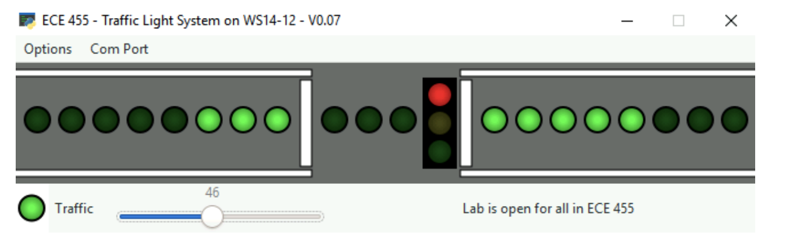
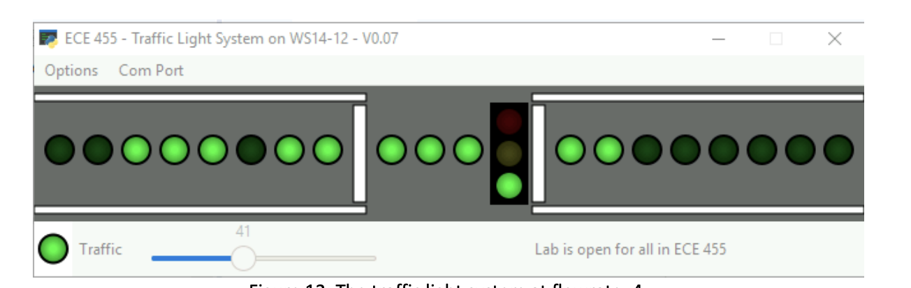
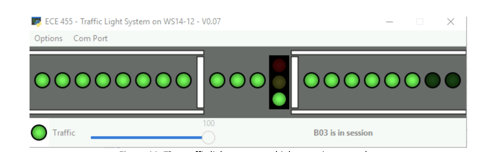

# Traffic-Light-System
A Traffic Light system using FreeRTOS on STM32F4 discovery board (ECE 455 at UVic)

## Project Design

Red Traffic Light

Green Traffic Light when potentiometer at low resistance

Green traffic light when potentiometer at highest resistance

There are 3 core tasks performed by the system -

### Traffic Flow task
This task reads the potentiometer values and pushes them to a queue every cycle. It pushes the flow value to the queue and the flow mutex.

### Traffic Manage task
It performs the generation and display in one task making it easier to manage the data flow between them and make the system faster. It can read the flow data using the queue and the light data using the light mutex.

### Traffic Light task
It is responsiblle for managing the LED lights using software timers. It can read the flow data using the flow mutex. The global light variables containing the information about the traffic light color value are handled using mutexes to ensure that no task gets the older value. 

